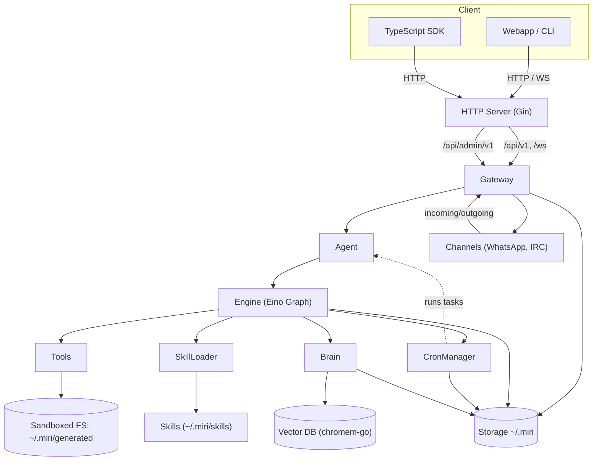

# Miri - Autonomous Agent Service

Miri is a local autonomous agent written in Go. It integrates the xAI API as backend, saves its state in files under the user's profile directory (`~/.miri` by default, override with `MIRI_STORAGE_DIR`), and exposes a REST API for configuration, storing human information, and delegating prompts to xAI.

The agent has its own "soul" defined in `~/.miri/soul.md` (bootstrapped from `templates/soul.md` on first run if missing).

## Architecture Overview



## Features
- **Unified Session**: Miri primarily uses a single default session (`miri:main:agent`) for all chat interactions, ensuring a continuous conversation history.
- **Eino Engine**: A powerful ReAct agent powered by [Eino](https://github.com/cloudwego/eino), supporting tool-augmented generation and autonomous reasoning loops.
- **Graph Orchestration**: Core logic is modeled as an Eino Graph with specialized nodes:
  - `retriever`: Proactively queries the **Brain** to inject long-term context into the chat session.
  - `agent`: Executes the ReAct loop with real-time tool calls and reasoning.
  - `brain`: Asynchronous post-processing node that extracts facts, reflects on the interaction, and maintains the memory system.
- **Grokipedia**: Built-in tool for looking up facts and summaries from [Grokipedia.com](https://grokipedia.com) directly.
- **Mole-Syn (Molecular Structure of Thought)**: Advanced reasoning topology framework that models agent thoughts as a graph of interconnected nodes and "bonds". See [The Brain](#the-brain-cognitive-architecture).
- **Long-term Memory**: Durable storage using a persistent vector database with automated maintenance and compaction. See [The Brain](#the-brain-cognitive-architecture).
- **File Management**:
  - `FileManagerTool`: Allows the agent to list and share files from the storage.
  - `GET /api/v1/files/*filepath`: Direct download access to files generated by the agent or uploaded to the storage.
  - **Channel Media Support**: WhatsApp and IRC channels now support sending files directly or via download links.
- **Checkpointing**: Eino-native graph persistence using `FileCheckPointStore` ensures long-running tasks can resume from the last successful tool execution.
- **System Awareness**: Automatically provides the LLM with system context (OS, Architecture, Go version) for more efficient command execution.
- **REST API** & **WebSocket**:
  - `POST /api/v1/prompt`: Blocking prompt execution.
  - `GET /api/v1/prompt/stream`: SSE streaming for real-time thoughts and tool execution.
  - `GET /ws`: WebSocket support for full-duplex interactive streaming. Supports authentication via `token` query param or `Sec-WebSocket-Protocol: miri-key, <key>`.
  - **OpenAPI Specification**: Detailed API documentation is available in `api/openapi.yaml`.
  - **SDK**: Client for [TypeScript](api/sdk/typescript).
- **Recurring Tasks**:
  - `TaskManagerTool`: Allows the agent to schedule recurring tasks (with cron expressions) that run prompts and report results to sessions or channels.
  - **WebSocket Notifications**: Task results are automatically pushed to active WebSocket clients associated with the task's `ReportSession`, including task name and ID.
  - `GET /api/admin/v1/tasks`: List all scheduled tasks via admin API.
- **Skills System**: 
  - Supports directory-based skills (with `SKILL.md`) and single-file Markdown skills (`.md`) in `~/.miri/skills/`.
  - **Learn Skill**: Integration with [agentskill.sh](https://agentskill.sh) for dynamic discovery and installation.
  - **Auto-Activation**: Core skills (`learn`, `skill_creator`) are automatically activated in the `miri:main:agent` session.
  - **Script Inference**: Automatically converts `.sh`, `.py`, and `.js` scripts into agent tools.
- **Sandboxed File-system**: All tool-initiated file operations (e.g., `execute_command`) are automatically redirected to the `~/.miri/generated` directory for safety and organization. The `FileManagerTool` and file download API are strictly restricted to this folder.

## The Brain: Cognitive Architecture

The **Brain** is Miri's central cognitive maintenance engine. It operates as an asynchronous post-processor, managing long-term knowledge, reasoning quality, and historical context.

### 🧠 Long-Term Memory (LTM)
Miri utilizes a dual-layered persistent memory system powered by [chromem-go](https://github.com/philippgille/chromem-go):

- **Memory Layers**:
  - **Facts**: Atomic pieces of world knowledge, user preferences, and specific events.
  - **Summaries**: Narrative records of conversation segments, providing continuity.
- **Persistence**: Data is stored in `~/.miri/vector_db` (or `MIRI_STORAGE_DIR`).
- **Embeddings**: Supports multiple providers (OpenAI, Mistral, Ollama, Jina, Cohere) or a **Native Mode** for entirely offline operation using a built-in `qwen3` static embedder.

### 🧪 Mole-Syn (Molecular Structure of Thought)
Advanced reasoning topology framework that models agent thoughts as a graph of interconnected "bonds":

- **Bond Types**:
  - **D (Deep Reasoning)**: Covalent-like, direct logical deductions.
  - **R (Self-Reflection)**: Hydrogen-like, consistency checks and error correction.
  - **E (Self-Exploration)**: Van der Waals-like, hypothesis testing and branching.
- **Scoring**: Computes stability scores and bond distributions to assess the cognitive quality of reasoning.
- **Persistence**: Reasoning traces are stored in a persistent graph for long-term cognitive analysis and behavioral tracking.

### ⚙️ Cognitive Maintenance Loop
The Brain performs continuous self-optimization to maintain high memory quality and efficient retrieval:

1.  **Fact Extraction**: Automatically promotes salient information from interactions to standalone long-term facts.
2.  **Self-Reflection**: Periodically reflects on session history to identify core insights or potential contradictions.
3.  **Compaction & Deduplication**:
    - Merges similar facts using LLM-guided semantic analysis.
    - Consolidates fragmented summaries into cohesive narrative blocks.
    - Prunes low-confidence memories or old, unused entries to minimize noise.
4.  **Auto-Triggering**: Maintenance runs based on interaction counts (every 100 turns), context usage (at 60% window), and system lifecycle events (startup, shutdown, session reset).

### 🔍 Retrieval Strategy
The `retriever` node proactively queries the Brain during every interaction:
- **Fact Retrieval**: Top 5 most relevant facts are injected into the system prompt.
- **Context Retrieval**: Top 3 relevant summaries are added to provide historical background.
- This ensures the agent is always aware of the user's preferences and past context without overwhelming the model's window.

## Prerequisites

- Go 1.25+
- xAI API key (set via env `XAI_API_KEY` or `config.yaml`)

## Build & Run

```bash
make build
./bin/miri-server
./bin/miri-server -config /path/to/my-config.yaml
```

### Makefile Targets

The project includes a `Makefile` for common tasks:

- `make server`: Builds the `miri-server` binary into `./bin/`.
- `make build`: Alias for `make server`.
- `make test`: Runs all Go tests.
- `make run-server`: Builds and runs the server.
- `make ts-sdk`: Generates, installs, and builds the TypeScript SDK.
- `make ts-sdk-publish`: Publishes the TypeScript SDK to npm (requires `NPM_TOKEN`).

## Configuration Cheatsheet

Admin credentials and server settings are managed in `config.yaml`:

```yaml
server:
  addr: ":8080"
  key: "your-server-key"
  admin_user: "admin"
  admin_pass: "admin-password"
storage_dir: "~/.miri"
```

### Authentication

1. **Server Key**: For `/api/v1/*` and `/ws`. Pass via `X-Server-Key` header.
2. **Admin Auth**: For `/api/admin/v1/*`. Use HTTP Basic Auth.

## Session Maintenance

Send `/new` as a prompt to clear the current session history and start fresh.
Note: Fact extraction and memory maintenance are now automated and continuous; manual flushing is no longer required.

## Build & Run (CLI Server)

### 1. Update Config (Admin)

```bash
curl -X POST http://localhost:8080/api/admin/v1/config \
  -H 'Content-Type: application/json' \
  -u admin:admin-password \
  -d '{
    "models": {
      "providers": {
        "xai": {
          "apiKey": "your_xai_key",
          "baseUrl": "https://api.x.ai/v1",
          "api": "openai"
        }
      }
    },
    "server": {
      "addr": ":8080",
      "key": "local-dev-key",
      "admin_user": "admin",
      "admin_pass": "admin-password"
    },
    "storage_dir": "/home/user/.miri"
  }'
```

### 2. Store Human Info (Admin)

```bash
curl -X POST http://localhost:8080/api/admin/v1/human \
  -H 'Content-Type: application/json' \
  -u admin:admin-password \
  -d '{
    "id": "user123",
    "data": {"name": "Alice", "pref": "coffee"},
    "notes": "Loves dark roast"
  }'
```

List:

```bash
curl -u admin:admin-password http://localhost:8080/api/admin/v1/human
```

### 3. Delegate Prompt

```bash
curl -X POST http://localhost:8080/api/v1/prompt \
  -H 'Content-Type: application/json' \
  -H 'X-Server-Key: local-dev-key' \
  -d '{"prompt": "Plan my week with gym and coding."}'
```

Streaming with SSE:

```bash
curl -N "http://localhost:8080/api/v1/prompt/stream?prompt=Plan+my+week&session_id=mysession" \
  -H 'X-Server-Key: local-dev-key'
```

## Authentication

Miri uses two types of authentication:

1. **Server Key Authentication**: Standard API endpoints (`/api/v1/*` and `/ws`) require the `X-Server-Key` header if `server.key` is set in the configuration.
2. **Basic Authentication**: Administrative endpoints (`/api/admin/v1/*`) require HTTP Basic Auth using `admin_user` and `admin_pass` from the configuration. (Defaults: `admin` / `admin-password`)

**Set server key (Admin):**

```bash
curl -X POST http://localhost:8080/api/admin/v1/config \
  -H 'Content-Type: application/json' \
  -u admin:admin-password \
  -d '{
    "server": {
      "addr": ":8080",
      "key": "your-secret-key",
      "admin_user": "admin",
      "admin_pass": "admin-password"
    }
  }'
```

**Use with key:**

```bash
curl -X POST http://localhost:8080/api/v1/prompt \
  -H 'Content-Type: application/json' \
  -H 'X-Server-Key: your-secret-key' \
  -d '{"prompt": "Plan my week."}'
```

On startup, warns if non-loopback bind (default `0.0.0.0`) without key.

Response includes xAI completion (soul + human context prepended).

## Project Structure

```
.
├── src/          # Go source
│   ├── cmd/main.go
│   └── internal/
├── scripts/      # Automated tool scripts (.sh, .py, .js)
├── skills/       # Skill definitions (.md files and optional folders)
├── templates/    # soul.md and system templates
├── go.mod
├── .gitignore
└── README.md
```

## Skills & Scripts

Miri supports dynamic extension through **Skills** and **Script Inference**.

### 1. Skills System

Skills are the primary way to extend Miri's intelligence and toolset. They are stored in `~/.miri/skills/` (or your configured storage dir).

#### Skill Formats
Miri supports two skill layouts:
- **Single-file (Primary)**: A plain Markdown file (e.g., `~/.miri/skills/my-skill.md`). This is the recommended layout for most skills.
- **Directory-based (Legacy/Bundled)**: A folder containing a `SKILL.md` file (e.g., `~/.miri/skills/my-skill/SKILL.md`).
- **Hybrid (Advanced)**: A flat Markdown file (e.g., `my-skill.md`) with an optional directory of the same name (`my-skill/`) containing a `scripts/` subdirectory for executable tools and other assets.

#### `SKILL.md` / `.md` Format
Both formats use YAML frontmatter for metadata:

```markdown
---
name: Web Analysis
description: Advanced web page analysis and data extraction instructions.
version: 1.2.0
tags: [web, scraper, analysis]
---
# Instructions
When performing web analysis, always follow these steps...
```

- **Name Matching**: If `name` is omitted from frontmatter, Miri uses the directory name or filename (without extension).
- **Dual Indexing**: Skills are indexed by both their frontmatter name and their filesystem name.
- **Normalization**: Miri automatically handles variations between hyphens and underscores (e.g., `frontend_design` matches `frontend-design`) and is case-insensitive.

#### Core Skills & Auto-Activation
On startup, Miri bootstraps core skills from its `templates/skills/` directory:
- **`learn`**: The primary skill for discovering and installing new capabilities from [agentskill.sh](https://agentskill.sh).
- **`skill_creator`**: Helps the agent design and write new skills for itself.

These core skills are **automatically activated** in the `miri:main:agent` chat session, meaning the agent is aware of them from the very first prompt.

#### Skill Tools
- `skill_use`: Manually activates a skill by injecting its full content into the current session's context.
- `skill_remove`: Uninstalls and deletes a local skill.
- `grokipedia`: Direct fact lookup and summary from Grokipedia.com.

### 2. Script Inference

Miri can automatically turn scripts into agent tools.
- **Global Scripts**: Any script in the root `scripts/` directory of the storage folder.
- **Skill Scripts**: Scripts located in a skill's `scripts/` subdirectory. For a flat skill `my-skill.md`, Miri looks in `~/.miri/skills/my-skill/scripts/`.

**Details:**
- **Supported Extensions**: `.sh`, `.py`, `.js`.
- **Naming**: The tool name is derived from the filename (e.g., `process_data.py` becomes tool `process_data`).
- **Sandboxing**: Scripts are executed with their working directory set to `~/.miri/generated/`.
- **Arguments**: Scripts receive arguments as positional parameters. Output (stdout/stderr) is returned to the agent.

### 3. Admin API for Skills

Manage and inspect skills via the Admin API (Basic Auth):
- `GET /api/admin/v1/skills`: List all installed skills with their metadata.
- `GET /api/admin/v1/skills/{name}`: Retrieve the full details and content of a specific skill.
- `GET /api/admin/v1/skills/commands`: List all available agent commands (tools), including inferred scripts.
- `GET /api/admin/v1/sessions/{id}/skills`: See which skills are currently "loaded" in a specific session's context.

## TypeScript SDK

The TypeScript SDK is located in `api/sdk/typescript`. It consists of hand-written core logic and generated API clients.

### Automated Generation

The SDK can be automatically updated whenever `api/openapi.yaml` changes:

```bash
make ts-sdk
```

This will:
1.  Generate a TypeScript Axios client into `api/sdk/typescript/generated`.
2.  Install dependencies in the SDK folder.
3.  Compile the TypeScript code.

### Publishing to npm

To publish the SDK to npm, provide your `NPM_TOKEN`:

```bash
make ts-sdk-publish NPM_TOKEN=your_npm_token
```

You can also specify an optional tag:

```bash
make ts-sdk-publish NPM_TOKEN=your_npm_token NPM_TAG=next
```

## Configuration

Miri uses a YAML configuration file located at `~/.miri/config.yaml`.

### Example `config.yaml`:
```yaml
storage_dir: ~/.miri

server:
  addr: :8080
  key: your-secret-key

models:
  mode: merge
  providers:
    xai:
      baseUrl: https://api.x.ai/v1
      apiKey: "$XAI_API_KEY"
      api: openai
      models:
        - id: xai/grok-4-1-fast-reasoning
          name: grok-4-1-fast-reasoning
          contextWindow: 2000000
          maxTokens: 8192
        - id: xai/grok-4-1-fast-non-reasoning
          name: grok-4-1-fast-non-reasoning
          contextWindow: 2000000
          maxTokens: 8192
        - id: xai/grok-3-mini
          name: grok-3-mini
          contextWindow: 131072
          maxTokens: 8192
    huggingface:
      baseUrl: https://api-inference.huggingface.co/v1/
      apiKey: "$HF_TOKEN"
      api: openai
      models:
        - id: meta-llama/Llama-3.3-70B-Instruct
          name: Llama 3.3 70B Instruct
          contextWindow: 128000
          maxTokens: 4096
    nvidia:
      baseUrl: https://integrate.api.nvidia.com/v1
      apiKey: "$NVIDIA_API_KEY"
      api: openai-completions
      models:
        - id: kimi-k2.5
          name: Kimi K2.5
          contextWindow: 131072
          maxTokens: 8192

agents:
  defaults:
    model:
      primary: xai/grok-4-1-fast-reasoning
  debug: true

channels:
  whatsapp:
    enabled: true
    allowlist: []
    blocklist: []
  irc:
    enabled: false
    host: "irc.libera.chat"
    port: 6697
    tls: true
    nick: "MiriBot"
    channels: ["#miri-test"]
```

## Customization

- Edit `templates/soul.md` for default agent behavior.
- Soul loaded on each `/prompt`.
- Human data indexed by ID, assembled into context.
- **API Key Overrides**: Provider API keys (`models.providers.&lt;provider&gt;.apiKey`) can be set via environment variables if empty in config. Use `&lt;PROVIDER&gt;_API_KEY` (e.g., `XAI_API_KEY=sk-...`, `NVIDIA_API_KEY=nvapi-...`). Runtime only, not persisted to YAML.

## Testing

**Unit tests:**
```bash
go test ./src/internal/tools/... -v
```

**Integration tests:**
```bash
chmod +x test_agent.sh
./test_agent.sh
```
Verifies endpoints without xAI key.

## Channels

Miri supports multiple communication channels with a unified filtering policy:
- **Allowlist**: If non-empty, only these senders can trigger the AI agent.
- **Blocklist**: Senders here are silently ignored.
- **Default Reply**: Senders not in allowlist (and not blocked) receive: "thanks for contact, we call you back !".

### WhatsApp
Enable in config or TUI. Scan QR code from stdout/TUI.
- Supports JID-based allowlist/blocklist.
- Persistent sqlite DB `~/.miri/whatsapp/whatsapp.db`.

### IRC
Enable in config or TUI.
- Configure server, TLS, NickServ authentication, and channels.
- Supports Nick/Channel-based allowlist/blocklist.

**Single POST /channels** (all channels: whatsapp/telegram/slack future):
- `{"channel":"whatsapp","action":"status"}` → `{"connected":bool,"logged_in":bool}`
- `{"channel":"whatsapp","action":"enroll"}` → `{"status":"enroll started"}` (check logs for QR)
- `{"channel":"whatsapp","action":"devices"}` → `{"devices":[...]}`
- `{"channel":"whatsapp","action":"send","device":"123@s.whatsapp.net","message":"hi"}` → `{"status":"sent"}`
- `{"channel":"whatsapp","action":"chat","device":"123@s.whatsapp.net","prompt":"hi"}` → `{"response":"..."}`

**WS unchanged**: `ws://localhost:8080/ws?channel=whatsapp&device=123@s.whatsapp.net` → stream chat.

## Running as Daemon/Service

Miri supports daemon mode via PID file (`~/.miri/miri.pid` by default) and graceful shutdown.

### Linux (systemd)

1. Customize `templates/systemd/miri.service` (set `ExecStart` to your `miri` binary path).

2. ```bash
sudo cp templates/systemd/miri.service /etc/systemd/system/miri@`whoami`.service
sudo systemctl daemon-reload
sudo systemctl enable miri@`whoami`
sudo systemctl start miri@`whoami`
```

Status: `sudo systemctl status miri@`whoami``

### macOS (launchd)

1. Customize `templates/launchd/com.miri.agent.plist` (`Program` path).

2. ```bash
mkdir -p ~/Library/LaunchAgents
cp templates/launchd/com.miri.agent.plist ~/Library/LaunchAgents/
launchctl load ~/Library/LaunchAgents/com.miri.agent.plist
```

Status: `launchctl list | grep miri`

Unload: `launchctl unload ~/Library/LaunchAgents/com.miri.agent.plist`

Logs: `tail ~/.miri/miri.out.log`

### Windows (NSSM)

1. Download NSSM: [nssm.cc](https://nssm.cc/download)

2. ```cmd
nssm install Miri "C:\\path\\to\\miri.exe"
nssm start Miri
```

Status: `sc query Miri` or Services.msc

Stop: `nssm stop Miri`

PID file: `%USERPROFILE%\\.miri\\miri.pid`

## Notes

- `/prompt` requires valid xAI API key.
- All data local, no cloud storage.
- Structured logs: `slog.Info`, etc.

Built with modern Go idioms.


---

## Architecture Overview


### Key Components
- HTTP Server (Gin): REST and WebSocket endpoints.
- Gateway: Orchestrates the primary Agent, channels, cron tasks, and storage.
- Agent: Wraps the Engine and session manager.
- Engine (Eino): ReAct loop with tools; graph nodes for retrieval, agent, and brain.
- Brain: Autonomous memory system using a vector DB; handles extraction, reflection, and compaction.
- Tools: `web_search`, `grokipedia`, `execute_command`, `skill_use`, `skill_remove`, `task_manager`, `file_manager`.
- SkillLoader: Loads skills from `~/.miri/skills/*.md` and `~/.miri/skills/**/SKILL.md`, inferring tools from `scripts/` directories.
- CronManager: Runs recurring tasks created via the `task_manager` tool; tasks stored in `~/.miri/tasks`.
- Storage: Persists `soul.md`, `human.md`, `facts.json`, skills, tasks, PID, etc.


## Quick Start (Updated)

Build and run the server binary:

```bash
make server           # builds bin/miri-server
make run-server       # builds (if needed) and runs
# or
bin/miri-server -config config.yaml
```

The entrypoint is `src/cmd/server/main.go`. The binary is `bin/miri-server` (created by the Makefile).


## Configuration Cheatsheet

Place a `config.yaml` in `~/.miri` (or pass `-config` to the server). Minimal example:

```yaml
storage_dir: ~/.miri
server:
  addr: :8080
  key: local-dev-key        # X-Server-Key used for /api/v1/* and /ws
  admin_user: admin         # Basic auth for /api/admin/v1/*
  admin_pass: admin-password
models:
  providers:
    xai:
      baseUrl: https://api.x.ai/v1
      apiKey: "$XAI_API_KEY"
      api: openai
agents:
  defaults:
    model:
      primary: xai/grok-4-1-fast-reasoning
```

- URL: the server listens on `server.addr` (e.g., `:8080`).
- Admin username/password: `server.admin_user` / `server.admin_pass`.
- X-Server-Key: `server.key` is required to call standard APIs and WebSocket.


## WebSocket Authentication

For standard HTTP clients you can set the header `X-Server-Key: <key>`.
For browsers where custom headers are restricted during the WS handshake, send the key as sub-protocols:

- `Sec-WebSocket-Protocol: miri-key, <key>` (two tokens, negotiated back by the server)

Example JavaScript browser client:

```js
const ws = new WebSocket(
  "ws://localhost:8080/ws",
  ["miri-key", "local-dev-key"]
);
ws.onmessage = (ev) => console.log(ev.data);
ws.onopen = () => ws.send(JSON.stringify({ prompt: "hello", stream: true }));
```


## Skills (Updated)

- Runtime skills live in `~/.miri/skills/`. Miri supports both single-file skills (`.md`) and directory-based skills (with `SKILL.md`).
- On startup, template skills from `templates/skills/` are copied to `~/.miri/skills` if missing (e.g., `learn`, `skill_creator`).
- The `miri:main:agent` chat session auto-activates core skills (`learn`, `skill_creator`) in context.
- Discovery and installation are handled exclusively by the `learn` skill. Legacy endpoints and manual installation tools have been removed.
- **Dynamic Activation**: Newly installed skills can be used immediately in the current session via `skill_use`.

Admin inspection endpoints (Basic Auth):
- `GET /api/admin/v1/skills` — List installed skills (name, description, version, tags).
- `GET /api/admin/v1/skills/{name}` — Get full details and content of a skill.
- `GET /api/admin/v1/skills/commands` — List all available agent commands (including inferred scripts).
- `GET /api/admin/v1/sessions/{id}/skills` — List skills currently loaded in a session (`miri:main:agent`).


## Recurring Tasks

- Use the `task_manager` tool to add/list/update/delete cron tasks. Each task executes a prompt on schedule.
- Tasks are persisted under `~/.miri/tasks/<id>.json` and scheduled by the built-in `CronManager`.
- Results can be reported to the active session (`miri:main:agent`) and/or to configured channels.

Admin read-only API:
- `GET /api/admin/v1/tasks` — list tasks
- `GET /api/admin/v1/tasks/{id}` — task details


## File-system Redirection for Tools (Sandboxing)

All tool-initiated file operations (e.g., `execute_command` and skill scripts) run with their working directory set to the designated generated directory (`~/.miri/generated` by default). This keeps artifacts contained and improves portability and safety. The `FileManagerTool` and file download API are strictly restricted to this folder.


## TypeScript SDK (Notes)

- OpenAPI spec: `api/openapi.yaml`.
- Generate & build: `make ts-sdk` (or `make ts-sdk-generate && make ts-sdk-build`).
- Publish: `make ts-sdk-publish NPM_TOKEN=... [NPM_TAG=next]`.


## Known Deviations From Older Docs

Some bullets above supersede earlier sections in this README:
- The binary is `bin/miri-server`, not `miri`.
- Legacy skill endpoints (`/api/admin/v1/skills/remote`, install via POST) and engine tools (`skill_install`, `skill_list_remote`, `skill_search`) were removed. Use the `learn` skill instead.
- Single-chat model: the primary chat session is `miri:main:agent`.
