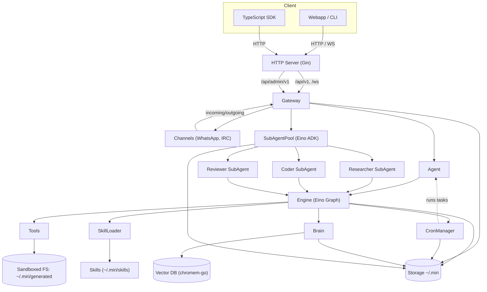

# Miri

Production-grade autonomous agent framework in Go 1.25+, featuring persistent vector 'brain' (chromem-go), Eino ReAct graphs, sub-agents, and cognitive auto-maintenance. Local-first: xAI Grok-powered, no cloud required.

Miri powers itself with xAI's Grok models (or any OpenAI-compatible provider), persists its 'brain' in a local vector database (`~/.miri/vector_db`), and exposes a rich REST/WebSocket API for chat, sub-agent orchestration, file management, and admin tasks. No cloud lock-in, no data leaks — everything stays on your machine.

Born from real-world needs: evolving from simple chat → tool-augmented ReAct loops → specialized sub-agents → cognitive self-maintenance with Mole-Syn reasoning graphs. It's production-ready, with Prometheus metrics and an embedded web dashboard.

The agent has its own "soul" defined in `~/.miri/soul.md` (bootstrapped from `templates/soul.md` on first run if missing).

## Architecture Overview


```mermaid
flowchart TD
  subgraph Client
    UI[Webapp / CLI]
    SDK[TypeScript SDK]
  end

  UI -->|"HTTP / WS"| REST["HTTP Server (Gin)"]
  SDK -->|HTTP| REST

  REST -->|"/api/v1, /ws"| GW[Gateway]
  REST -->|/api/admin/v1| GW

  GW --> AG[Agent]
  GW --> CH["Channels (WhatsApp, IRC)"]
  CH -->|incoming/outgoing| GW

  AG --> EN["Engine (Eino Graph)"]
  EN --> TL[Tools]
  EN --> SL[SkillLoader]
  EN --> CR[CronManager]
  EN --> BR[Brain]

  SL --> SK["Skills (~/.miri/skills)"]
  TL --> FS[("Sandboxed FS: ~/.miri/generated")]
  BR --> VM[("Vector DB (chromem-go)")]

  GW --> ST[("Storage ~/.miri")]
  EN --> ST
  CR --> ST
  BR --> ST
  CR -.->|runs tasks| AG
  GW --> DP["SubAgentPool (Eino ADK)"]
  DP --> SA1["Researcher SubAgent"]
  DP --> SA2["Coder SubAgent"]
  DP --> SA3["Reviewer SubAgent"]
  SA1 & SA2 & SA3 --> EN
  DP --> ST
```

## Conceptual Foundations

Miri's architecture draws on several intersecting lines of research in AI reasoning, memory systems, and cognitive science. Rather than adopting any single paradigm, it synthesizes ideas from each into a cohesive agent framework where reasoning, retrieval, and long-term memory reinforce one another.

### ReAct: Reasoning + Acting in Language Models

The ReAct paradigm (Yao et al., [arXiv:2210.03629](https://arxiv.org/abs/2210.03629)) demonstrated that interleaving chain-of-thought reasoning with tool use produces more grounded, less hallucinatory outputs than either approach alone. Miri implements this via [Eino](https://github.com/cloudwego/eino) graphs: the engine constructs a directed acyclic graph where a `retriever` node injects long-term context, an `agent` node executes the ReAct loop (observe → think → act → observe), and a `brain` node performs asynchronous post-processing. Each tool call is a discrete graph edge, enabling checkpointing and resumption of multi-step tasks.

### Retrieval-Augmented Generation (RAG) & Vector Search

RAG (Lewis et al., NeurIPS 2020) addresses the fundamental limitation of fixed-context LLMs by retrieving relevant documents at inference time. Miri's implementation uses [chromem-go](https://github.com/philippgille/chromem-go), an embedded vector database backed by HNSW indexing (Malkov & Yashunin, [arXiv:1603.09320](https://arxiv.org/abs/1603.09320)) for approximate nearest-neighbor search. Unlike typical RAG pipelines that query a static corpus, Miri's vector store is *living*: the agent continuously writes to it (fact extraction, reflections, summaries) and a maintenance loop compacts, deduplicates, and prunes entries over time. Embeddings can be generated via API (OpenAI, Mistral, xAI) or locally using a Qwen3 model with PCA-384 dimensionality reduction — keeping the entire pipeline offline when desired.

### Mole-Syn: Molecular Structure of Thought

Mole-Syn is Miri's original reasoning topology framework, inspired by GraphRAG-style locality (Microsoft Research, 2024) and molecular graph theory. It models each reasoning trace as a directed graph where nodes are discrete thought steps and edges carry one of three typed bonds:

| Bond | Name | Semantics |
|------|------|-----------|
| **D** | Deep | Logical deduction chains — the backbone of rigorous reasoning |
| **R** | Reflect | Self-correction and error-checking — metacognitive loops |
| **E** | Explore | Divergent what-if branches — creative hypothesis generation |

The LLM is guided to produce structured reasoning via a **topology injection prompt** (`templates/brain/topology_injection.prompt`), and the output is parsed into a `TopologyAnalysis` struct containing steps, bonds, a topology score, and a D/R/E bond distribution. This graph is then merged into the persistent `MemoryGraph` (backed by the [dominikbraun/graph](https://github.com/dominikbraun/graph) library). Key mechanisms:

- **`GetStrongPath`**: Traverses the graph to extract the highest-value reasoning chain for a session, preferring Deep bonds.
- **`deep_bond_uses` boost**: Facts retrieved during Deep-heavy reasoning turns get their importance counter incremented, causing them to rank higher in future retrievals.
- **`topology_score`**: A birth-quality metric assigned when a fact is first created, used as a tie-breaker in ranking.
- **Session pruning**: Per-session node caps (`max_nodes_per_session`) prevent unbounded graph growth while preserving the most valuable reasoning paths.

The result is that Miri doesn't just *store* what it knows — it tracks *how well* it reasoned about it, and uses that signal to prioritize retrieval.

### Memory Consolidation: From Neuroscience to Code

Biological memory systems don't simply record — they actively reorganize during offline periods. Miri's cognitive maintenance loop draws on the hippocampal consolidation model (Walker & Stickgold, *Annu. Rev. Psychol.* 2004), where memories are replayed, strengthened, or pruned during sleep. The implementation maps this to a five-stage async pipeline:

1. **Extract** — LLM-driven fact extraction from conversation buffers (confidence threshold ≥ 0.7, with duplicate detection).
2. **Reflect** — Generate meta-observations about patterns, contradictions, and user preferences.
3. **Deduplicate** — Batched LLM-assisted merging (facts in chunks of 30, summaries in chunks of 20) with per-operation timeouts.
4. **Promote** — Elevate recurring summary themes into atomic facts for faster retrieval.
5. **Compact** — Consolidate overlapping summaries into coherent narratives; prune stale or low-value entries.

Maintenance triggers fire on write thresholds (every 100 messages), context-window pressure (60% utilization), and lifecycle events (startup/shutdown). This ensures the memory store remains lean and interference-free without manual intervention.

### Hybrid Retrieval: Graph + Vector Fusion

At query time, Miri combines two retrieval signals:

- **Graph backbone**: `GetStrongPath` extracts the most relevant reasoning chain from the Mole-Syn graph, providing structured context about *how* the agent previously reasoned about related topics.
- **Vector recall**: Standard cosine-similarity search over the Facts and Summaries collections, ranked by a composite score that incorporates `deep_bond_uses` (importance) and `topology_score` (birth quality).

The fused context is prepended to the LLM prompt, giving the agent both semantic relevance (vector) and reasoning provenance (graph) — a richer signal than either alone.

## Features

### 🤖 Agent & Engine
- **Eino ReAct Engine**: Powered by [Eino](https://github.com/cloudwego/eino); supports tool-augmented generation and autonomous multi-step reasoning loops.
- **Graph Orchestration**: Core logic modeled as an Eino Graph with three specialized nodes:
  - `retriever` — proactively queries the Brain to inject long-term context before each turn.
  - `agent` — executes the ReAct loop with real-time tool calls and reasoning.
  - `brain` — asynchronous post-processing: fact extraction, reflection, memory maintenance.
- **Modular Engine Interfaces**: `Engine` is split into focused interfaces (`Responder`, `SkillManager`, `MemoryManager`, `Lifecycle`) — all typed, no `any` returns.
- **Unified Session**: All chat interactions use a single persistent session (`miri:main:agent`) for continuous conversation history.
- **Checkpointing**: Eino-native graph state persistence via `FileCheckPointStore` — long-running tasks resume from the last successful tool execution.
- **System Awareness**: LLM is automatically provided with OS, architecture, shell, and package manager context for accurate command generation.

### 🤝 Sub-Agents: Delegated Specialist Execution

Miri's sub-agent system implements a **delegation-based multi-agent architecture** where the main orchestrator agent spawns specialized workers for discrete tasks. Each sub-agent is a self-contained ReAct loop with its own tool set, system prompt, and execution context — running asynchronously while the main agent continues serving the user.

#### Architecture

The system comprises two layers:

1. **Registry** (`src/internal/engine/subagents/registry.go`): At startup, `BuildSubAgentTools` constructs three role-specific Eino tools — Researcher, Coder, and Reviewer — each wrapping a `SubAgentTool` (inner ReAct loop, up to 50 reasoning steps) inside a `LoggingWrapper` (transcript persistence, 10-minute timeout, run tracking). The orchestrator LLM sees these as callable tools and invokes them when the user explicitly requests delegation.

2. **Pool** (`src/internal/subagent/pool.go`): The `Pool` manages the full lifecycle of sub-agent runs — spawning goroutines with cancellable contexts, persisting run records (`SubAgentRun`) to storage, and automatically injecting completed results as facts into the Brain via the `FactInjector` interface. This ensures sub-agent outputs become part of the agent's long-term memory without manual intervention.

#### Role Definitions

Each role loads its behavior from a customizable prompt template (`templates/subagents/<role>.prompt`) and is equipped with a curated tool set:

| Role | Prompt Template | Available Tools | Purpose |
|------|----------------|-----------------|---------|
| **Researcher** | `researcher.prompt` | `web_search`, `fetch`, `grokipedia` | Searches the web, fetches pages, and produces structured summaries with sources and confidence scores |
| **Coder** | `coder.prompt` | `execute_command`, `file_manager`, `web_search`, `fetch` | Writes, executes, and debugs code in a sandboxed environment (`uploads/`) with TDD support |
| **Reviewer** | `reviewer.prompt` | `web_search`, `fetch` | Critiques and quality-checks work — code review, fact-checking, or output validation |

**Customization**: Edit any prompt template in `~/.miri/subagents/` (synced from `templates/subagents/` on startup) and restart. The coder prompt, for example, mandates TDD and structured JSON output to enable downstream chaining.

#### Execution Lifecycle

```
User: "Research Zoo Knie history"
  → Orchestrator LLM invokes Researcher tool
    → LoggingWrapper creates SubAgentRun record (status: pending)
    → SubAgentTool starts ReAct loop (up to 50 steps)
      → web_search("Zoo Knie history") → fetch(url) → synthesize
    → Output persisted (status: done)
    → Result auto-injected as Brain fact (type: subagent_result)
  → Orchestrator returns summary to user
```

**Run states**: `pending` → `running` → `done` | `failed` | `canceled`

Each run tracks token usage (`prompt_tokens`, `output_tokens`) and cost (`total_cost`), and the full message transcript is preserved for audit via the admin API.

#### Invocation Methods

1. **Natural language** (via orchestrator): The user asks the main agent to delegate — e.g., *"Use the researcher to find Zoo Knie elephant history"* — and the LLM issues the appropriate tool call. Sub-agents are only invoked on explicit user request, never proactively.

2. **REST API** (programmatic control and chaining):
   ```bash
   # Spawn a sub-agent run
   ID=$(curl -s -X POST /api/v1/subagents \
     -H 'X-Server-Key: $KEY' \
     -d '{"role":"coder","goal":"Python CLI that finds max of a list, with tests"}' | jq -r .id)

   # Poll status and output
   curl /api/v1/subagents/$ID -H 'X-Server-Key: $KEY'

   # Retrieve full message transcript (admin)
   curl /api/admin/v1/subagents/$ID/transcript -u admin:pass

   # List all runs for a session (admin)
   curl '/api/admin/v1/subagents?session=main' -u admin:pass

   # Cancel a running sub-agent (admin)
   curl -X DELETE /api/admin/v1/subagents/$ID -u admin:pass
   ```

#### Chaining Sub-Agents

Sub-agents can be composed into pipelines — each run's structured JSON output feeds the next:

1. **Research** → Researcher produces `{summary, sources[], confidence}`
2. **Code** → Coder receives research output as context, produces `{plan, code_files{}, tests[], coverage}`
3. **Review** → Reviewer evaluates coder output, produces `{score, issues[], approved, feedback}`
4. **Deliver** → Final artifacts available via `/api/v1/files` for download or ZIP export

Because each sub-agent's output is automatically injected into the Brain, the orchestrator retains full context across the pipeline without explicit state passing.

#### Brain Integration

When a sub-agent run completes, the `Pool.injectFact` method stores the result as a Brain fact with metadata:

| Metadata Key | Value |
|-------------|-------|
| `type` | `subagent_result` |
| `subagent_id` | Run UUID |
| `role` | `researcher` / `coder` / `reviewer` |
| `session` | Parent session ID |
| `created_at` | Completion timestamp |

This means the main agent can recall sub-agent findings in future conversations — e.g., *"What did the researcher find about Zoo Knie last week?"* — without re-running the task.

### 🧠 Memory & Cognition

Miri's memory system is a self-maintaining cognitive substrate that transforms ephemeral conversations into durable, retrievable knowledge — without manual intervention. It combines vector-based semantic search with a graph-based reasoning topology to deliver context that is both relevant and provenance-aware. For full architectural details, see [The Brain](#-the-brain-self-evolving-cognitive-core).

#### Dual-Layer Persistent Memory

The Brain maintains two vector collections in [chromem-go](https://github.com/philippgille/chromem-go) (HNSW-indexed):

| Layer | Granularity | Role |
|-------|-------------|------|
| **Facts** | Atomic statements | Precise, individually rankable knowledge units — the primary retrieval target |
| **Summaries** | Multi-turn narratives | Preserve conversational arcs and thematic continuity across sessions |

Facts are extracted from conversations via LLM-driven parsing (confidence threshold ≥ 0.7, with duplicate detection). Summaries capture broader context that would be lost if only atomic facts were stored. The maintenance pipeline continuously promotes high-value summary themes into facts and consolidates redundant summaries.

#### Mole-Syn: Reasoning as a Molecular Graph

The Mole-Syn (Molecular Structure of Thought) framework models each reasoning trace as a directed graph with typed bonds — **D** (Deep: logical deduction), **R** (Reflect: metacognitive self-correction), and **E** (Explore: divergent hypothesis generation). A topology injection prompt (`templates/brain/topology_injection.prompt`) guides the LLM to produce structured `[D/R/E]`-tagged reasoning, which is parsed into a `TopologyAnalysis` and merged into the persistent `MemoryGraph` (backed by [dominikbraun/graph](https://github.com/dominikbraun/graph)).

**Why it matters**: Facts born from Deep-heavy reasoning accumulate a `deep_bond_uses` counter that boosts their rank in future retrievals. The `topology_score` serves as a birth-quality tie-breaker. Over time, the Brain naturally surfaces its most rigorously derived knowledge first.

#### Hybrid Retrieval

At query time, two signals are fused:
- **Graph backbone**: `GetStrongPath` extracts the highest-value reasoning chain from the Mole-Syn graph, providing structured context about *how* the agent previously reasoned about related topics.
- **Vector recall**: Cosine-similarity search over Facts and Summaries, ranked by a composite score incorporating `deep_bond_uses` (importance) and `topology_score` (birth quality).

The fused context is prepended to the LLM prompt, delivering both semantic relevance and reasoning provenance.

#### Cognitive Maintenance

An asynchronous five-stage pipeline (inspired by hippocampal memory consolidation) prevents unbounded growth:

1. **Extract** → LLM parses conversations into JSON fact arrays (confidence ≥ 0.7, duplicate-checked)
2. **Reflect** → Generate meta-observations: patterns, contradictions, user preferences
3. **Deduplicate** → Batched LLM merge (facts in chunks of 30, summaries in chunks of 20; 5 min timeout/batch)
4. **Promote** → Elevate recurring summary themes into atomic facts
5. **Compact** → Consolidate overlapping summaries; prune stale/low-value entries

**Triggers**: Write threshold (every 100 messages), context-window pressure (60% utilization), lifecycle events (startup/shutdown).

#### Embeddings & Graph Pruning

- **Embeddings**: API-based (OpenAI, Mistral, xAI) or fully offline via native Qwen3 with PCA-384 dimensionality reduction (`use_native_embeddings: true`).
- **Graph pruning**: Per-session node cap (`max_nodes_per_session: 2000`) balances retention and efficiency, preserving high-value reasoning paths while preventing unbounded growth.

### 🛠️ Tools

Miri exposes a curated set of tools to the ReAct engine, each registered as an Eino `InvokableTool` with typed parameters and JSON I/O. All file-producing operations are sandboxed to `~/.miri/generated` — no tool can write outside this boundary.

#### Core Tools

| Tool | Name | Description |
|------|------|-------------|
| **Shell Execution** | `execute_command` | Sandboxed command runner (`src/internal/engine/tools/cmd.go`). Validates sh syntax, auto-prefixes Homebrew paths on Apple Silicon, truncates output at 4 KB, and post-execution sandboxes any files created outside `~/.miri/generated` back into the sandbox directory. |
| **Web Search** | `web_search` | Real-time web search via DuckDuckGo or Brave, returning structured results with titles, URLs, and snippets. |
| **Web Fetch** | `fetch` | Fetches and extracts readable content from URLs, handling HTML parsing and content extraction. |
| **File Manager** | `file_manager` | List, share, and manage files in `~/.miri/generated` (`src/internal/engine/tools/filemanager.go`). Strict sandbox enforcement — path traversal attempts are rejected. |
| **Task Manager** | `task_manager` | Schedule recurring tasks with cron expressions (`src/internal/engine/tools/taskmanager.go`). Results are reported to the originating session or channel. |
| **Chrome MCP Browser** | `chrome_browser` | Native Google Chrome automation via MCP (Model Context Protocol) over the remote debugging port (`src/internal/engine/tools/chrome_mcp.go`). Supports `navigate`, `snapshot`, `click`, `type`, and `scroll` actions. Requires Chrome 146+ with `--remote-debugging-port=9222`. |
| **KeePass** | `retrieve_password`, `store_password` | Secure credential storage in a local KeePassXC database (`passwords.kdbx`) via `src/internal/engine/tools/keepass.go`. |
| **Grokipedia** | `grokipedia` | Knowledge lookup tool that queries the LLM for encyclopedic information on a given topic, returning structured summaries. |

#### Self-Evolution Tools

These tools enable the agent to introspect and modify its own capabilities at runtime:

| Tool | Description |
|------|-------------|
| **`cotgraph_analyze`** | Parses reasoning traces (tagged with `[D/R/E]` and `[Thought:]` markers) into a directed graph and detects cycles or loops in self-modification retries — preventing infinite retry spirals. |
| **`skill_local_install`** | Installs a raw Markdown skill directly to `~/.miri/skills/*.md` and triggers a hot-reload of the skill loader mid-conversation, enabling the agent to teach itself new capabilities without restart. |
| **`topology_analyze`** | Computes graph-theoretic metrics (valency, diameter, cyclomatic complexity) on Go call graphs and prunes redundant tool chains (e.g., repeated failed git operations). |

#### Dynamic Tool Registry

Beyond the built-in tools, `LoadDynamicTools` (`src/internal/engine/tools/registry.go`) scans `~/.miri/tools/*.json` for user-defined tool definitions. Each JSON file specifies a name, description, parameters, and function body — with safety validation (max 1 KB, no shell metacharacters) before registration.

### 🎓 Skill System

Skills are Miri's extensible knowledge and capability modules — Markdown documents with optional YAML frontmatter that the agent can search, activate, and use at runtime. The `SkillLoader` (`src/internal/engine/skills/skills.go`) manages discovery, parsing, and hot-reloading.

#### Skill Formats

Two formats are supported, both stored in `~/.miri/skills/`:

| Format | Structure | Example |
|--------|-----------|--------|
| **Single-file** | `skill-name.md` with YAML frontmatter (`name`, `description`, `version`, `tags`) | `learn.md`, `skill_creator.md` |
| **Directory-based** | `skill-name/SKILL.md` + optional `scripts/` folder | A skill with executable scripts that become agent tools |

Frontmatter is parsed via YAML (`gopkg.in/yaml.v3`); skills are indexed by both their declared `name` and their filename/directory name for flexible lookup.

#### Script Inference

When a directory-based skill contains a `scripts/` folder, the loader automatically converts `.sh`, `.py`, and `.js` files into Eino `InvokableTool` instances. Each script becomes a callable tool with its filename as the tool name and a generated description. Scripts execute in a sandboxed context via the same command runner used by `execute_command`.

#### Discovery & Installation

- **`learn` skill** (auto-activated): Searches the [agentskill.sh](https://agentskill.sh) registry for community skills and installs them to `~/.miri/skills/` via `SearchAndInstall` (`src/internal/tools/skillmanager/skillmanager.go`).
- **`skill_creator`** (auto-activated): Guides the agent through creating new skills from scratch — generating the Markdown structure, frontmatter, and optional scripts.
- **`skill_local_install`** (self-evolution tool): Writes raw Markdown content directly as a skill file and triggers a hot-reload, enabling mid-conversation skill creation without restart.
- **Remote listing**: `ListRemoteSkills` fetches the full registry from agentskill.sh with name, description, author, and tags.
- **Removal**: `RemoveSkill` deletes a skill by name (file or directory) from `~/.miri/skills/`.

#### Runtime Integration

The engine exposes three skill-related tools to the ReAct loop:
- **`skill_search`**: Fuzzy-searches loaded skills by name, tags, or description keywords.
- **`skill_use`**: Activates a skill by name, injecting its full Markdown content into the conversation context.
- **`skill_remove`**: Uninstalls a skill and triggers a reload.

Core skills (`learn`, `skill_creator`) are automatically activated in the `miri:main:agent` session at startup. All other skills are available on demand via search and activation.

### 🌐 REST API & WebSocket
- Full REST API (`/api/v1/*`) with blocking prompts, SSE streaming, and WebSocket support (verbose thought/tool events).
- Admin API (`/api/admin/v1/*`) for configuration, brain inspection, skill management, and task monitoring.
- Dream mode endpoint for offline parallel chain-of-thought simulation.
- Prometheus metrics at `/metrics`. OpenAPI spec at `api/openapi.yaml`.
- See [API Reference](#api-reference) for the complete endpoint catalog.

### 📡 Channels & Tasks
- **WhatsApp** (via [whatsmeow](https://github.com/tulir/whatsmeow)) and **IRC** (via [girc](https://github.com/lrstanley/girc)) with file/media support and unified allowlist/blocklist filtering.
- **Recurring Tasks**: Cron-scheduled prompts with WebSocket push notifications to active clients.
- See [Channels](#channels) and [Recurring Tasks](#recurring-tasks) for details.

### 📁 File Management
- Sandboxed file operations in `~/.miri/generated/` — all tool-generated artifacts stay contained.
- REST endpoints for listing, downloading, previewing, zipping, uploading, and deleting files.
- Built-in dashboard file explorer with path-traversal protection.
- See [File Management Endpoints](#file-management-endpoints) and [File-System Sandboxing](#file-system-sandboxing) for details.

## 🧠 The Brain: Self-Evolving Cognitive Core

The Brain is Miri's persistent cognitive substrate — a self-maintaining memory system that extracts knowledge from conversations, organizes it into a reasoning graph, and retrieves it with hybrid precision. It operates autonomously: no manual memory management is required.

### How It Works in Practice

Chat "Plan trip to Zoo Knie" → the Brain extracts atomic facts ("Zoo Knie has Indian rhinos", "elephants perform daily"), generates a reflection ("user is interested in animal welfare"), and stores a narrative summary ("Trip planning session focused on Swiss zoo animals"). On the next prompt mentioning zoos, the hybrid retriever pulls these facts *and* the reasoning chain that produced them — delivering context that is both semantically relevant and provenance-aware.

### Dual-Layer Memory Architecture

The Brain maintains two distinct vector collections in [chromem-go](https://github.com/philippgille/chromem-go):

| Layer | Purpose | Granularity | Example |
|-------|---------|-------------|---------|
| **Facts** | Atomic knowledge units | Single statement | "Zoo Knie relocated its elephant herd in 2024" |
| **Summaries** | Narrative continuity | Multi-turn arc | "Extended trip planning session: Swiss zoos, animal focus, budget constraints" |

Facts are the retrieval workhorses — small, precise, and individually rankable. Summaries preserve conversational context that would be lost if only atomic facts were stored. The maintenance pipeline continuously promotes high-value summary themes into facts and consolidates redundant summaries into coherent narratives.

**Embeddings**: API-based (OpenAI, Mistral, xAI) or fully offline via native Qwen3 with PCA-384 dimensionality reduction (`use_native_embeddings: true`). The offline path ensures zero external API calls for the entire memory pipeline.

### 🧪 Mole-Syn: Reasoning as a Molecular Graph

The Mole-Syn (Molecular Structure of Thought) framework models reasoning traces as directed graphs with typed chemical-style bonds:

```
[Thought A] ──D──▶ [Thought B] ──R──▶ [Thought C] ──E──▶ [Thought D]
   (premise)    (deduction)     (self-check)     (hypothesis)
```

**Bond types** encode the *nature* of each reasoning transition:
- **D (Deep)**: Logical deduction — the strongest signal of rigorous reasoning.
- **R (Reflect)**: Metacognitive self-correction — catching errors, revising assumptions.
- **E (Explore)**: Divergent exploration — generating alternatives, what-if scenarios.

**The pipeline**:
1. A **topology injection prompt** (`templates/brain/topology_injection.prompt`) guides the LLM to produce structured `[D/R/E]` tagged reasoning.
2. A **topology extraction prompt** parses the trace into a `TopologyAnalysis` (steps, bonds, score, D/R/E distribution).
3. The analysis is merged into the persistent `MemoryGraph` via `AddStepsFromAnalysis`.
4. `GetStrongPath` traverses the graph to extract the highest-value chain for retrieval, preferring Deep bonds.

**Why it matters**: Facts born from Deep-heavy reasoning (`deep_bond_uses` counter) rank higher in future retrievals. The `topology_score` serves as a birth-quality tie-breaker. Over time, the Brain naturally surfaces its most rigorously derived knowledge first.

**Pruning**: Per-session node caps (`max_nodes_per_session: 2000`) prevent unbounded growth while preserving high-value paths.

### 🔄 Cognitive Maintenance: Why It Scales

The Brain runs an asynchronous maintenance loop (inspired by hippocampal memory consolidation) that prevents unbounded growth and keeps retrieval quality high:

| Stage | Operation | Implementation |
|-------|-----------|----------------|
| 1 | **Extract** | LLM parses conversation → JSON array of facts (confidence ≥ 0.7, duplicate-checked) |
| 2 | **Reflect** | LLM generates meta-observations: patterns, contradictions, user preferences |
| 3 | **Deduplicate** | Batched LLM merge — facts in chunks of 30, summaries in chunks of 20 (5 min timeout/batch) |
| 4 | **Promote** | Recurring summary themes elevated to atomic facts for faster retrieval |
| 5 | **Compact** | Overlapping summaries consolidated; stale/low-value entries pruned |

**Triggers**: Write threshold (every 100 messages), context-window pressure (60% utilization), lifecycle events (startup/shutdown).

**Prompt templates** driving each stage live in `templates/brain/`:
`extract.prompt`, `reflection.prompt`, `deduplicate_facts.prompt`, `deduplicate_summaries.prompt`, `promote_facts.prompt`, `consolidate_summaries.prompt`, `compact.prompt`.

### Retrieval Configuration

```yaml
brain:
  retrieval:
    graph_steps: 8          # Max Mole-Syn graph traversal depth
    facts_top_k: 20         # Facts returned per query
    summaries_top_k: 5      # Summaries returned per query
  max_nodes_per_session: 2000  # Mole-Syn graph node cap per session
```

### Monitoring

The Brain's evolution is fully observable via admin endpoints:
- `GET /api/admin/v1/brain/facts` — browse all stored facts (paginated).
- `GET /api/admin/v1/brain/summaries` — browse all stored summaries (paginated).
- `GET /api/admin/v1/brain/topology` — inspect the Mole-Syn graph structure, bond distributions, and session statistics.

## 🚀 Quick Start

### First Run — Guided Setup Wizard

Miri detects missing configuration on first launch and starts an interactive CLI wizard:

```
$ make server && ./bin/miri-server
=== Miri Setup Wizard ===
? LLM Provider (xai/openai/anthropic/groq) › xai
? Enter API Key/Token › xai-abc123...
? Default Model › grok-4-1-fast-reasoning
? Storage Directory › ~/.miri
? Server Address › :8080
? Server Key › my-secret-key-123
? Admin Username › admin
? Admin Password › super-secure-pass

✅ Setup complete! Config saved to ~/.miri/config.yaml
Server starting on http://localhost:8080
Dashboard: http://localhost:8080/dashboard
Admin API: /api/admin/v1 (Basic Auth: admin/super-secure-pass)
```

The wizard creates `~/.miri/config.yaml`, bootstraps the soul (`soul.md`), core skills (`learn`, `skill_creator`), and an empty Brain — then starts the HTTP server with the embedded dashboard.

### Talk to Miri

```bash
# Blocking prompt
curl -X POST http://localhost:8080/api/v1/prompt \
  -H "Content-Type: application/json" \
  -H "X-Server-Key: my-secret-key-123" \
  -d '{"prompt": "Who am I?"}'

# Server-Sent Events (streaming)
curl -N "http://localhost:8080/api/v1/prompt/stream?prompt=Plan+my+day" \
  -H "X-Server-Key: my-secret-key-123"

# WebSocket (verbose thoughts + tool calls)
wscat -c "ws://localhost:8080/ws" \
  -H "Sec-WebSocket-Protocol: miri-key, my-secret-key-123" \
  -x '{"prompt": "Research latest Go news"}'
```

### Delegate to Sub-Agents

```bash
# Spawn a researcher
ID=$(curl -s -X POST http://localhost:8080/api/v1/subagents \
  -H "Content-Type: application/json" \
  -H "X-Server-Key: my-secret-key-123" \
  -d '{"role": "researcher", "goal": "Latest advances in Go 1.25"}' | jq -r .id)

# Poll progress
curl "http://localhost:8080/api/v1/subagents/$ID" -H "X-Server-Key: my-secret-key-123"

# Full transcript (admin)
curl "http://localhost:8080/api/admin/v1/subagents/$ID/transcript" -u admin:super-secure-pass
```

### CLI Flags

| Flag | Effect |
|------|--------|
| `--setup` | Re-run the setup wizard (overwrites existing config) |
| `--reset-config` | Delete config and re-run wizard |
| `--config /path/to/file.yaml` | Load an alternative configuration file |

---

## Prerequisites

- **Go 1.25+** — modern idioms enforced (`slices`, `maps`, `errors.Is`/`Join`, `atomic.Bool`, `context.WithCancelCause`, etc.)
- **xAI API key** (or any OpenAI-compatible provider) — set via `XAI_API_KEY` environment variable or `config.yaml`
- **Node 20+** — required only for TypeScript SDK generation and dashboard builds

---

## Build & Run

```bash
make server           # build bin/miri-server (includes dashboard)
./bin/miri-server     # start with default config (~/.miri/config.yaml)
./bin/miri-server -config /path/to/custom.yaml
```

The entrypoint is `src/cmd/server/main.go`. The binary is `bin/miri-server`.

### Makefile Targets

| Target | Description |
|--------|-------------|
| `make server` / `make build` | Build the `miri-server` binary into `./bin/` (includes dashboard) |
| `make test` | Run all Go tests |
| `make run-server` | Build and run the server |
| `make ts-sdk` | Generate, install, and build the TypeScript SDK |
| `make ts-sdk-publish` | Publish the TypeScript SDK to npm (requires `NPM_TOKEN`) |
| `make dashboard-build` | Build the Svelte dashboard from `../miri-dashboard` |
| `make deploy` | Deploy to production |

### Docker

```bash
docker run -p 8080:8080 -e XAI_API_KEY=your_key alexrockshouts/miri-combined:latest
```

Access the dashboard at `http://localhost:8080`.

### Building the Dashboard from Source

The embedded web dashboard lives in a sibling repository. To build locally:

```bash
git clone https://github.com/AlexRockShouts/miri-dashboard ../miri-dashboard
make server   # builds SDK → dashboard → Go binary with embedded assets
```

`make server` automatically: (1) builds the TypeScript SDK, (2) compiles the Svelte dashboard, (3) copies assets to `src/cmd/server/dashboard`, and (4) embeds them in the Go binary.

---

## Configuration

Miri uses a YAML configuration file at `~/.miri/config.yaml` (or the path passed via `--config`).

### Minimal Example

```yaml
storage_dir: ~/.miri
server:
  addr: :8080
  key: local-dev-key          # X-Server-Key for /api/v1/* and /ws
  admin_user: admin           # Basic Auth for /api/admin/v1/*
  admin_pass: admin-password
models:
  providers:
    xai:
      baseUrl: https://api.x.ai/v1
      apiKey: "$XAI_API_KEY"
      api: openai
agents:
  defaults:
    model:
      primary: xai/grok-4-1-fast-reasoning
```

### Full Example (Multi-Provider)

```yaml
storage_dir: ~/.miri

server:
  addr: :8080
  key: your-secret-key

models:
  mode: merge
  providers:
    xai:
      baseUrl: https://api.x.ai/v1
      apiKey: "$XAI_API_KEY"
      api: openai
      models:
        - id: xai/grok-4-1-fast-reasoning
          name: grok-4-1-fast-reasoning
          contextWindow: 2000000
          maxTokens: 8192
        - id: xai/grok-4-1-fast-non-reasoning
          name: grok-4-1-fast-non-reasoning
          contextWindow: 2000000
          maxTokens: 8192
        - id: xai/grok-3-mini
          name: grok-3-mini
          contextWindow: 131072
          maxTokens: 8192
    huggingface:
      baseUrl: https://api-inference.huggingface.co/v1/
      apiKey: "$HF_TOKEN"
      api: openai
      models:
        - id: meta-llama/Llama-3.3-70B-Instruct
          name: Llama 3.3 70B Instruct
          contextWindow: 128000
          maxTokens: 4096
    nvidia:
      baseUrl: https://integrate.api.nvidia.com/v1
      apiKey: "$NVIDIA_API_KEY"
      api: openai-completions
      models:
        - id: kimi-k2.5
          name: Kimi K2.5
          contextWindow: 131072
          maxTokens: 8192

agents:
  defaults:
    model:
      primary: xai/grok-4-1-fast-reasoning
  debug: true

channels:
  whatsapp:
    enabled: true
    allowlist: []
    blocklist: []
  irc:
    enabled: false
    host: "irc.libera.chat"
    port: 6697
    tls: true
    nick: "MiriBot"
    channels: ["#miri-test"]
```

### Environment Variable Overrides

Provider API keys can be set via environment variables when the `apiKey` field is empty or uses the `$VAR` syntax in config. The convention is `<PROVIDER>_API_KEY`:

```bash
XAI_API_KEY=sk-... ./bin/miri-server
NVIDIA_API_KEY=nvapi-... ./bin/miri-server
HF_TOKEN=hf_... ./bin/miri-server
```

These are runtime-only overrides and are not persisted to YAML.

### Customization

- **Soul**: Edit `templates/soul.md` (or `~/.miri/soul.md` after first run) to define the agent's personality and behavioral guidelines. The soul is loaded into context on every prompt.
- **Human Data**: Store user profiles via `POST /api/admin/v1/human` — indexed by ID and assembled into context alongside the soul.
- **Session Reset**: Send `/new` as a prompt to clear the current session history and start fresh. Memory maintenance is fully automated; no manual flushing is required.

---

## Authentication

Miri uses two authentication layers:

| Layer | Scope | Mechanism | Header / Credential |
|-------|-------|-----------|-------------------|
| **Server Key** | `/api/v1/*`, `/ws` | API key | `X-Server-Key: <key>` |
| **Admin Auth** | `/api/admin/v1/*` | HTTP Basic Auth | `admin_user` / `admin_pass` from config |

**WebSocket authentication** supports two methods for browser compatibility:

1. **Header** (non-browser clients): `X-Server-Key: <key>`
2. **Sub-protocol** (browsers): `Sec-WebSocket-Protocol: miri-key, <key>` — the server negotiates the protocol back.

```js
// Browser WebSocket example
const ws = new WebSocket("ws://localhost:8080/ws", ["miri-key", "local-dev-key"]);
ws.onmessage = (ev) => console.log(ev.data);
ws.onopen = () => ws.send(JSON.stringify({ prompt: "hello", stream: true }));
```

On startup, Miri warns if binding to a non-loopback address without a server key configured.

---

## API Reference

### Core Endpoints

| Method | Endpoint | Description |
|--------|----------|-------------|
| `POST` | `/api/v1/prompt` | Blocking prompt execution |
| `GET` | `/api/v1/prompt/stream` | SSE streaming for real-time output |
| `GET` | `/ws` | Full-duplex WebSocket (ping/pong 54 s, graceful close) |
| `GET` | `/api/v1/sessions/{id}/cost` | Total LLM cost (USD) for a session |
| `POST` | `/api/v1/dream` | Offline dream mode — simulates parallel CoT paths, scores and persists the best plan |
| `GET` | `/metrics` | Prometheus metrics (request counts, latency histograms, prompt totals) |

### Sub-Agent Endpoints

| Method | Endpoint | Auth | Description |
|--------|----------|------|-------------|
| `POST` | `/api/v1/subagents` | Key | Spawn a sub-agent run (role + goal + optional model override) |
| `GET` | `/api/v1/subagents/{id}` | Key | Poll run status and output |
| `GET` | `/api/v1/subagents/{id}/transcript` | Key | Retrieve full message transcript |
| `GET` | `/api/admin/v1/subagents` | Admin | List all runs (filter by `?session=`) |
| `DELETE` | `/api/admin/v1/subagents/{id}` | Admin | Cancel a running sub-agent |

### File Management Endpoints

| Method | Endpoint | Description |
|--------|----------|-------------|
| `GET` | `/api/v1/files?path=uploads/dir` | List / navigate directory (`[{name, size, mod, isDir}]`) |
| `GET` | `/api/v1/files/path/file` | Download file (attachment header) |
| `GET` | `/api/v1/files/file?view=true` | Preview text file (≤ 1 MB) |
| `GET` | `/api/v1/files/mydir?zip=true` | Download directory as ZIP (recursive) |
| `POST` | `/api/v1/files/upload` | Upload file to `uploads/` |
| `DELETE` | `/api/v1/files` | Delete file or directory (`{"path":"uploads/tmp","recursive":true}`) |

All file operations are sandboxed to the `uploads/` prefix — no path traversal is possible. The embedded dashboard includes a built-in file explorer.

### Admin Endpoints

| Method | Endpoint | Description |
|--------|----------|-------------|
| `POST` | `/api/admin/v1/config` | Update runtime configuration |
| `GET/POST` | `/api/admin/v1/human` | Manage user profiles |
| `GET` | `/api/admin/v1/brain/facts` | Browse stored facts (paginated) |
| `GET` | `/api/admin/v1/brain/summaries` | Browse stored summaries (paginated) |
| `GET` | `/api/admin/v1/brain/topology` | Inspect Mole-Syn graph structure and bond distributions |
| `GET` | `/api/admin/v1/skills` | List installed skills |
| `GET` | `/api/admin/v1/skills/{name}` | Get skill details and content |
| `GET` | `/api/admin/v1/skills/commands` | List all agent commands (including inferred scripts) |
| `GET` | `/api/admin/v1/sessions/{id}/skills` | List skills loaded in a session |
| `GET` | `/api/admin/v1/tasks` | List scheduled tasks |
| `GET` | `/api/admin/v1/tasks/{id}` | Get task details |

### Conventions

- **Paginated lists**: All list endpoints accept `?limit=50&offset=0` (default 50, max 1000).
- **Standardized errors**: `{ "code": <int>, "message": "..." }`.
- **Verbose streaming**: WebSocket emits `[Thought: ...]`, `[Tool: name(args)]`, and `[ToolResult: ...]` events inline before the final answer — detect these prefixes to render a verbose chat view.
- **OpenAPI specification**: `api/openapi.yaml` with auto-generated [TypeScript SDK](api/sdk/typescript).

---

## Channels

Miri supports multiple communication channels with a unified filtering policy:

- **Allowlist**: If non-empty, only listed senders can trigger the AI agent.
- **Blocklist**: Listed senders are silently ignored.
- **Default reply**: Unrecognized senders receive a configurable fallback message.

### WhatsApp

Powered by [whatsmeow](https://github.com/tulir/whatsmeow) with file and media support.

- Enable via `channels.whatsapp.enabled: true` in config.
- Scan the QR code from stdout on first enrollment.
- Supports JID-based allowlist/blocklist.
- Persistent session in `~/.miri/whatsapp/whatsapp.db` (SQLite).

### IRC

Powered by [girc](https://github.com/lrstanley/girc) with TLS and NickServ authentication.

- Enable via `channels.irc.enabled: true` in config.
- Configure server, port, TLS, nick, and channels.
- Supports nick/channel-based allowlist/blocklist.

### Channel Control API

All channel operations use a single endpoint: `POST /api/v1/channels`

```bash
# Check status
curl -X POST /api/v1/channels -d '{"channel":"whatsapp","action":"status"}'
# → {"connected": true, "logged_in": true}

# Enroll (triggers QR code in logs)
curl -X POST /api/v1/channels -d '{"channel":"whatsapp","action":"enroll"}'

# Send a message
curl -X POST /api/v1/channels \
  -d '{"channel":"whatsapp","action":"send","device":"123@s.whatsapp.net","message":"hi"}'

# Chat via agent
curl -X POST /api/v1/channels \
  -d '{"channel":"whatsapp","action":"chat","device":"123@s.whatsapp.net","prompt":"hi"}'
```

WebSocket streaming per device: `ws://localhost:8080/ws?channel=whatsapp&device=123@s.whatsapp.net`

---

## Recurring Tasks

The `task_manager` tool enables cron-scheduled prompts that execute autonomously:

- Tasks are persisted under `~/.miri/tasks/<id>.json` and scheduled by the built-in `CronManager`.
- Results are reported to the active session (`miri:main:agent`) and/or configured channels via WebSocket push notifications.
- Manage tasks via natural language (*"Remind me every Monday at 9am to check my calendar"*) or the admin API.

---

## File-System Sandboxing

All tool-initiated file operations (`execute_command`, skill scripts, coder sub-agent) run with their working directory set to `~/.miri/generated/`. The `FileManagerTool` and file download API are strictly restricted to this sandbox. This keeps generated artifacts contained, portable, and safe from accidental overwrites.

---

## TypeScript SDK

The TypeScript SDK (`api/sdk/typescript`) provides typed API clients generated from `api/openapi.yaml`.

| Command | Description |
|---------|-------------|
| `make ts-sdk` | Generate, install, and build the SDK |
| `make ts-sdk-publish NPM_TOKEN=... [NPM_TAG=next]` | Publish to npm |
| `make ts-sdk-build-link` | Build and `npm link` for local development |
| `make dashboard-link` | Link the local SDK into the dashboard |
| `make dashboard-unlink` | Unlink and revert to the published npm package |

**Local development** uses `npm link` for fast iteration; CI/Docker uses the published `@alexrockshouts/miri-sdk` package. Edit SDK → `make ts-sdk-build-link` → restart server to iterate.

---

## Testing

**Unit tests:**
```bash
make test
# or selectively:
go test ./src/internal/engine/tools/... -v
```

**Integration tests** (verifies endpoints without an LLM API key):
```bash
chmod +x test_agent.sh
./test_agent.sh
```

---

## Project Structure

```
.
├── Makefile                  # Build, test, SDK, dashboard, deploy targets
├── README.md
├── api/
│   ├── openapi.yaml          # OpenAPI 3.0 specification
│   └── sdk/typescript/       # Generated + hand-written TypeScript SDK
├── bin/                      # Compiled binaries (miri-server)
├── config.yaml               # Sample configuration
├── src/
│   ├── cmd/server/           # main.go entrypoint
│   └── internal/
│       ├── agent/            # Agent wrapper and session management
│       ├── api/              # Gin HTTP handlers and middleware
│       ├── channels/         # WhatsApp and IRC integrations
│       ├── config/           # YAML config loading and validation
│       ├── cotgraph/         # Chain-of-thought graph analysis
│       ├── cron/             # CronManager for recurring tasks
│       ├── dream/            # Dream mode (parallel CoT simulation)
│       ├── engine/           # Eino ReAct engine, graph, agent loop
│       │   ├── memory/       # Brain, cognitive maintenance, Mole-Syn
│       │   ├── skills/       # Skill loader and frontmatter parser
│       │   ├── subagents/    # Sub-agent registry and tool builders
│       │   └── tools/        # Core tool implementations
│       ├── gateway/          # Gateway orchestrator
│       ├── llm/              # LLM client abstraction
│       ├── session/          # Session state management
│       ├── storage/          # Persistent storage (filesystem-backed)
│       ├── subagent/         # Sub-agent pool and lifecycle
│       ├── system/           # OS/arch detection for system awareness
│       ├── tasks/            # Task persistence and scheduling
│       ├── tools/            # Shared tool utilities and skill manager
│       └── topology/         # Topology analysis and scoring
├── templates/
│   ├── brain/                # Prompt templates for memory pipeline
│   ├── embeddings/           # Embedding model configurations
│   ├── skills/               # Core skill templates (learn, skill_creator)
│   └── subagents/            # Sub-agent role prompts
├── go.mod / go.sum
└── vendor/                   # Vendored dependencies
```

---

## License

Licensed under the [Apache License, Version 2.0](LICENSE).
